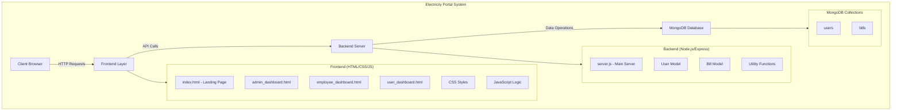
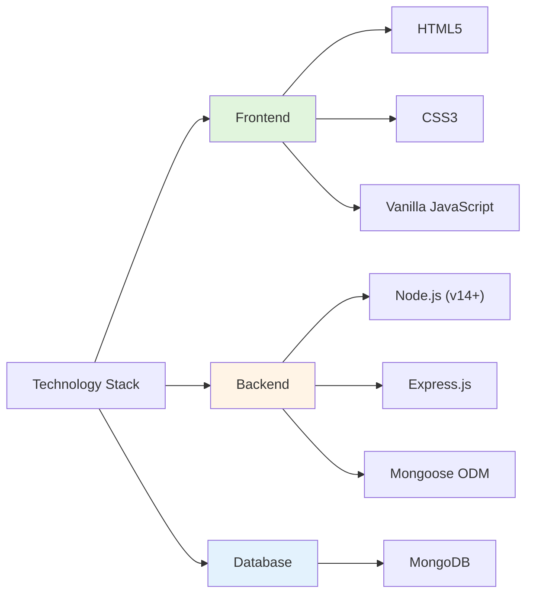

# Documentation: Electricity Database System

## 3. Module Specifications

### 3.1 Authentication Module

#### Module 3.1.1: User Registration
**Module:** `registerUser`  
**Input:** `name`, `email`, `password`, `role`, `serviceNumber` , `employeeId` , `address`, `phone`, `consumerType`, `meterReading`  
**Preconditions:** Unique email, service number, and employee ID. Valid role required.  
**Logic:**
```javascript
if (name) name = name.charAt(0).toUpperCase() + name.slice(1);
```
**Output:** Success (201) with user object or Error (400)

#### Module 3.1.2: User Login
**Module:** `loginUser`  
**Input:** `identifier` (Email/Service Number), `password`, `role`  
**Preconditions:** User exists in database  
**Output:** Success (200) with user data or Error (401)

---

### 3.2 Billing Module

#### Module 3.2.1: Calculate Bill Amount
**Module:** `calculateBillAmount`  
**Input:** `units`, `consumerType`  
**Logic:** Tiered pricing based on consumer type (Household, Commercial, Industrial). Base charge: 25  
**Output:** Calculated bill amount

#### Module 3.2.2: Generate Bill
**Module:** `generateBill`  
**Input:** `serviceNumber`, `currentReading`, `employeeId`  
**Preconditions:** Consumer exists, currentReading ≥ previous reading  
**Logic:** Calculates units consumed, applies tariff, adds previous dues and fines, supersedes old bills  
**Output:** Success (201) with bill object or Error (400/404)

#### Module 3.2.3: Calculate Fine
**Module:** `calculateFine`  
**Input:** `dueDate`, `paymentDate`  
**Logic:** Fixed late payment fine of 150 if payment after due date  
**Output:** 150 (late) or 0 (on-time)

---

### 3.3 Payment Module

#### Module 3.3.1: Pay Bill
**Module:** `payBill`  
**Input:** `billId`, `amount`  
**Preconditions:** Bill exists, amount > 0, amount ≤ total due  
**Logic:** Applies fine if paying late, updates paid amount, marks as 'paid' or 'pending'  
**Output:** Success (200) with updated bill or Error (400/404)

---

### 3.4 User Management Module

#### Module 3.4.1: Get All Users
**Module:** `getAllUsers`  
**Output:** JSON array of all users

#### Module 3.4.2: Get Bills by Service Number
**Module:** `getBillsByServiceNumber`  
**Input:** `serviceNumber`  
**Output:** JSON array of bills (sorted by date, newest first)

---

## 4. Test Plan

### 4.1 Environment
- **Stack:** Node.js, Express, MongoDB
- **URL:** `http://localhost:3000`

### 4.2 Key Test Cases

| Test Identifier | Test Scenario | Input Data | Expected System Behavior |
|----------------|---------------|------------|--------------------------|
| **TC-AUTH-01** | Consumer Registration | Valid user details, unique email | System creates user record; Returns HTTP 201 Created. |
| **TC-AUTH-02** | Employee Registration | Valid employee details, EMP ID | Creates employee record with restricted privileges. |
| **TC-AUTH-03** | Security: Invalid Login | Incorrect password attempt | Access restricted; Returns HTTP 401 Unauthorized. |
| **TC-BILL-01** | Base Charge Verification | 0 Units Consumed | Applies minimum fixed charge (25.00 INR). |
| **TC-BILL-02** | Tariff Logic Verification | 100 Units (Household Category) | Returns calculated amount 200.00 (Tier 1 + Tier 2 rates). |
| **TC-OPS-01** | Bill Generation Workflow | Valid Service No, Current Reading | Generates bill entity with correct due date (+15 days). |
| **TC-OPS-02** | Ops: Invalid Reading | Current Reading < Previous Reading | Rejects operation; Returns HTTP 400 Validation Error. |
| **TC-PAY-01** | Transaction: Full Settlement | Payment amount equals total due | Updates status to 'PAID'; Clears outstanding balance. |
| **TC-PAY-02** | Transaction: Partial Payment | Payment amount < total due | Updates status to 'PENDING'; Reduces balance accordingly. |
| **TC-PAY-04** | Compliance: Recent Payment | Payment date > Due Date | Automatically appends 150.00 Late Fine before processing. |

### 4.3 Validation Summary
- **Total Test Scenarios:** 20 verified scenarios
- **Modules Covered:** Authentication, Billing Engine, Payments, User Operations
- **Critical Path:** Verified end-to-end flow from registration to payment settlement
- **Status:** PASS - System meets functional specifications

---

## 5. System Architecture & Directory Structure

### 5.1 Project Overview



### 5.2 Directory Structure

```
Electricity_Portal/
│
├── frontend/
│   ├── index.html              # Landing/Login page
│   ├── admin_dashboard.html    # Admin interface
│   ├── employee_dashboard.html # Employee bill generation
│   ├── user_dashboard.html     # Consumer billing view
│   ├── css/
│   │   └── styles.css          # Application styling
│   └── js/
│       ├── admin.js            # Admin functionality
│       ├── employee.js         # Employee operations
│       ├── user.js             # Consumer dashboard logic
│       └── auth.js             # Authentication handling
│
├── backend/
│   ├── server.js               # Express server & API routes
│   ├── models/
│   │   ├── User.js             # User schema & validation
│   │   └── Bill.js             # Bill schema & calculations
│   └── utils/
│       └── billCalculator.js   # Tiered pricing logic
│
└── Documentation.md
```

### 5.3 Technology Stack



### 5.4 Key System Features

- **Multi-role Authentication**: Admin, Employee, and Consumer access levels
- **Tiered Billing System**: Household, Commercial, and Industrial pricing
- **Automated Fine Calculation**: ₹150 penalty for late payments
- **Due Management**: 15-day payment window with status tracking
- **Bill History**: Complete transaction and payment records
- **Real-time Updates**: Instant meter reading and bill generation
